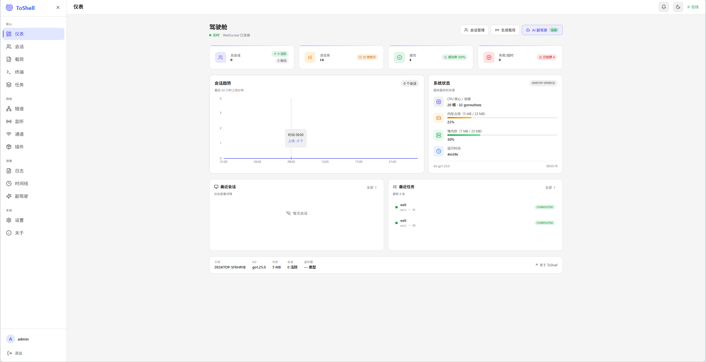
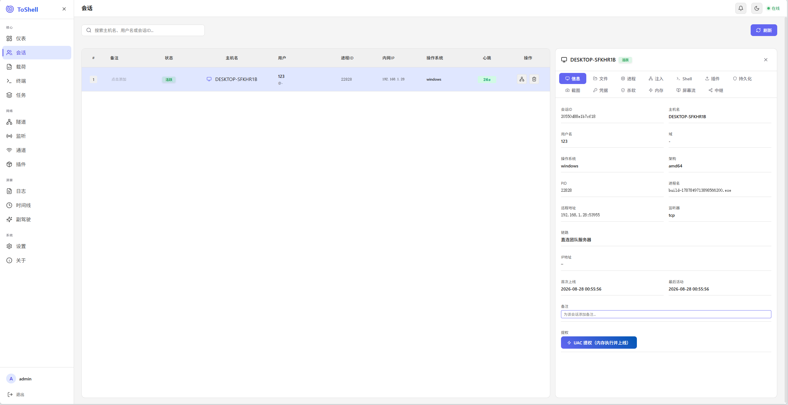
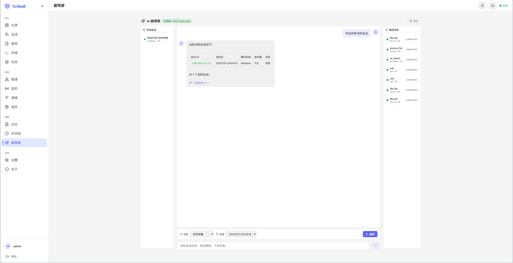
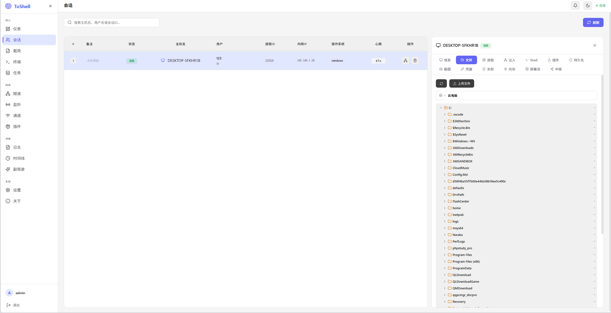
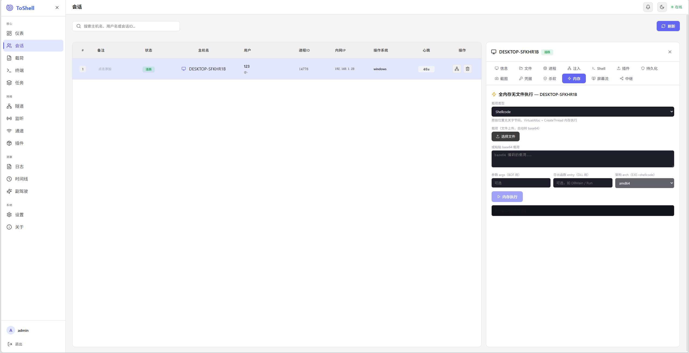
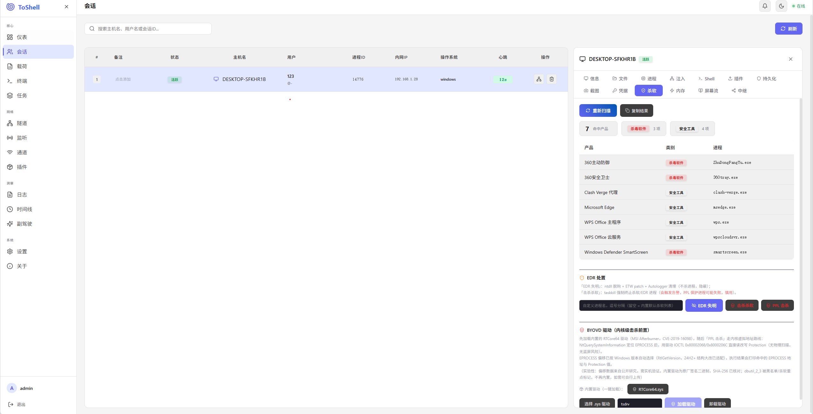

# ToShell Team Server

> 自托管的 C2（命令与控制）远程管理平台，用于**授权红队演练、渗透测试与安全研究**。
> **仅限获得授权后使用。** 严禁未授权的入侵 / 攻击 / 数据窃取。

**v1.2.0** · [MIT License](LICENSE) · 作者：青山 / Q1lintu / c0ffee

---

## 这是什么

ToShell 是一个轻量 C2 框架，由 **服务端（Team Server）+ Web 控制台 + 多平台植入端** 组成，覆盖「生成载荷 → 会话管理 → 任务执行」的完整链路。单二进制即可部署整套服务，开箱即用。

## 核心特性

**多通道 · 多平台植入端**
- 回连通道：**TCP / HTTP(S) / WebSocket / MQTT**（可配合域前置、TLS 拟态）。
- 植入端：**Windows / Linux / macOS**，格式 `exe / dll / raw / shellcode`，支持 `full / light` 档案与老系统兼容（Go 1.20 工具链）。

**全功能会话操作**
- 交互 Shell、目录/文件管理（上传/下载/删除/预览，断点续传）、进程枚举/注入/杀死。
- 截图、实时屏幕流、凭据收集、UAC 提权、持久化、文件无执行、BOF/DLL/EXE 插件。

**组网与隧道**
- Beacon Mesh 多跳中继、SOCKS5 隧道代理（横向访问内网）、中继链路加密。

**任务流 + AI 副驾驶**
- 任务流/剧本化执行（可编辑模板，跑完自动 AI 复盘）。
- **AI 副驾驶**：联网搜索、远程下载工具、按用途插件/内存加载、结果分析与下一步建议；支持**权限审批**（影响会话的操作需确认）。

**免杀与隐蔽**
- 每构建随机化（配置块魔数/密钥、字符串密钥、API 哈希种子）、编译期字符串混淆、apihash/PEB 动态解析、**反沙箱 + 启动随机延迟**、进程注入随机良性宿主。

**加密通信**
- 控制帧 AES-256-GCM 认证加密 + 隧道数据 SM4-GCM（国密自研），密钥域分离；配置热更新。

## 功能截图

> 截图位于 `docs/screenshots/`。

**仪表盘**：会话/任务概览、图表与实时状态。



**会话管理**：多平台会话、任务下发与状态跟踪。



**AI 副驾驶**：联网分析、工具调用与权限审批。



**文件管理**：上传 / 下载 / 在线预览，断点续传。



**内存执行**：免落地加载 DLL / EXE / BOF 与内存操作。



**杀软识别**：检测目标环境杀软 / 安全监控进程，辅助规避。



## 快速开始

### 一键部署（推荐）

```bash
cd release && chmod +x deploy.sh && ./deploy.sh   # Linux / macOS
# Windows: 在 release 目录运行 deploy.bat
```

> 首次运行会基于 `server.yaml.example` 自动生成配置，请先修改敏感项。完整部署说明见 [USAGE.md](USAGE.md)。

### 手动

```bash
./toserver -config configs/server.yaml
# 浏览器打开 http://<服务器IP>:18081（api_port）
```

## 生成植入端

登录 Web 控制台 →「生成载荷」→ 选平台 / 通道 / 免杀配置 → 构建 → 目标机运行即回连。

> 生成载荷时可用「启动随机延迟」等默认参数（在「设置 → 植入端」配置，构建时取全局默认）。

## 配置

复制 `configs/server.yaml.example` → 修改 `public_host / api_keys / jwt_key / encryption_key / admin_password`；更多字段说明见 [USAGE.md](USAGE.md)。设置页可热更新多数配置（无需重启）。

## 开源与授权

- 使用说明：[USAGE.md](USAGE.md)
- 安全披露：[SECURITY.md](SECURITY.md)
- License：[MIT](LICENSE)
- **免责声明**：仅用于授权测试与学习研究，禁止任何未授权的入侵、攻击或数据窃取行为；使用者后果自负。

---

**© 2026 ToShell (Tanovo) · MIT License** · 仅供授权测试与学习
